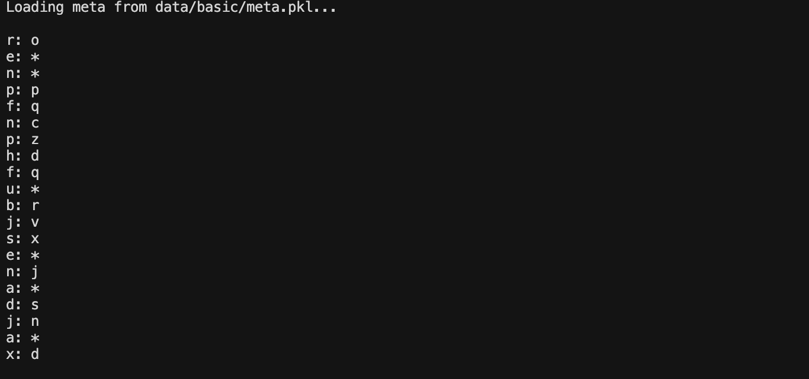
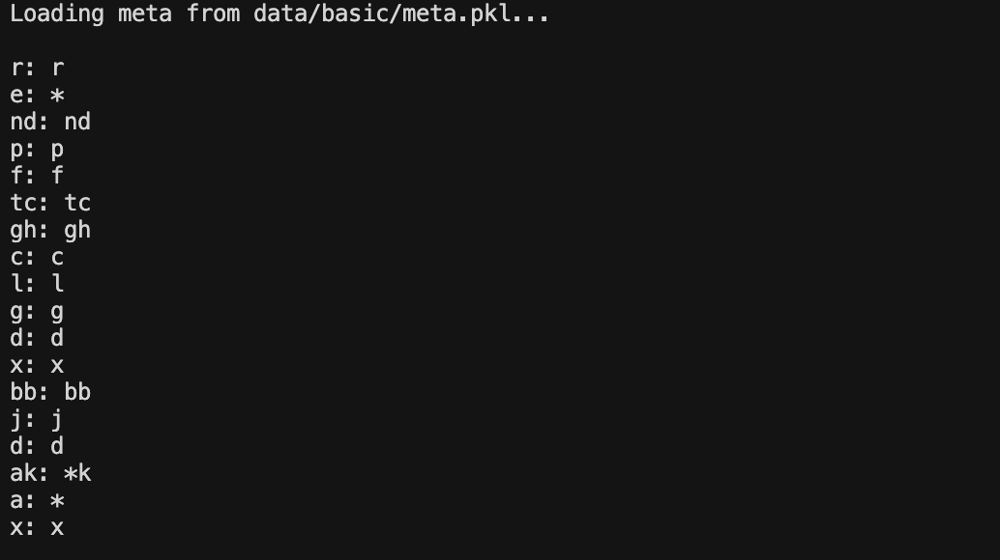
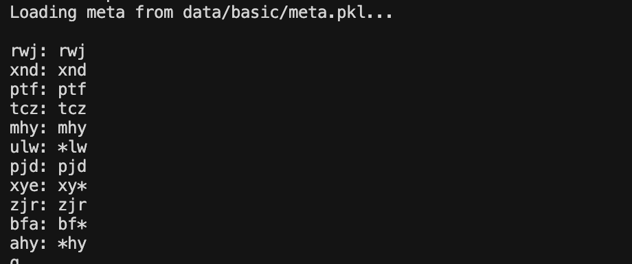
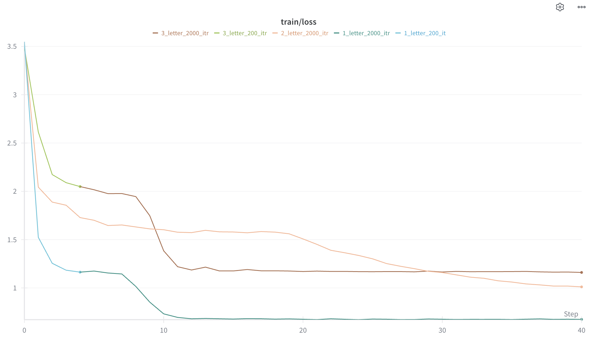

# Replace Vowels with "*" Experiment

This experiment trains a character-level language model to learn vowel masking - replacing all vowels (a, e, i, o, u) with '*' while keeping consonants unchanged.

## Data Format

The model learns from a stream of word pairs showing original words and their vowel-masked versions:

```
cat: c*t
dog: d*g
abc: *bc
aei: ***
xyz: xyz
```

## Directory Structure

```
replace-vowels/
├── README.md
├── config/
│   └── basic.py
├── data/
│   └── basic/
│       ├── prepare.py
│       ├── meta.pkl
│       ├── train.bin
│       └── val.bin
├── images/
│   ├── 1_lettter_200_itr.png
│   ├── image.png
│   └── Screenshot*.png
└── out/
```

## Setup

1. **Activate conda environment:**

```bash
conda activate nanoGPT
```

2. **Install dependencies** (if needed):

```bash
pip install torch numpy tiktoken wandb
```

3. **Prepare data:**

```bash
cd replace-vowels
python data/basic/prepare.py
```

## Training

From the `replace-vowels` directory:

```bash
NANOGPT_CONFIG=../../comp560-nanoGPT/configurator.py python -u ../../comp560-nanoGPT/train.py config/basic.py
```

## Sampling

After training:

```bash
NANOGPT_CONFIG=../../comp560-nanoGPT/configurator.py python -u ../../comp560-nanoGPT/sample.py config/basic.py --num_samples=1 --max_new_tokens=100 --seed=2345
```

## Experiment Log

### Run 1: 1-letter words, max_iters=200
**Purpose:** Verify workflow with simplest possible case

**Config:** 
- `WORD_LEN = 1` (single characters only)
- `max_iters=200`, `device=cpu`, `compile=False`

**Results:**
- Workflow verified successfully
- Model learned pattern perfectly
- Loss dropped from ~3.5 to ~0.1-0.2

**Sample output:**



### Run 2: 1-letter words, max_iters=2000
**Purpose:** Compare 200 vs 2000 iterations for single characters

**Config:**
- `WORD_LEN = 1`
- `max_iters=2000`, `device=cpu`, `compile=False`

**Results:**
- Perfect performance (similar to 200 iterations)
- Loss stabilized at ~0.1-0.2

- Both 200 and 2000 iterations achieved near-identical results

**Sample output:**


### Run 3: 2-letter words, max_iters=2000
**Purpose:** Test model on 2-character words

**Config:**
- `WORD_LEN = 2` (1-2 characters)
- `max_iters=2000`, `device=cpu`, `compile=False`

**Results:**
- Model learned pattern successfully
- Most outputs correct
- Occasional minor errors
- Loss stabilized at ~1.0-1.1 (higher than 1-letter, as expected)

**Sample output:**


### Run 4: 3-letter words, max_iters=2000
**Purpose:** Test model on 3-character words only

**Config:**
- `WORD_LEN = 3` (exactly 3 characters, no 1 or 2 letter words)
- `max_iters=2000`, `device=cpu`, `compile=False`

**Results:**
- Excellent performance on 3-letter words
- Loss stabilized at ~1.1-1.2 (similar to 2-letter words)
- Model successfully handles words with 0, 1, 2, or 3 vowels

**Sample output:**


### Run 5: 3-letter words, max_iters=200
**Purpose:** Compare 200 vs 2000 iterations for 3-letter words

**Config:**
- `WORD_LEN = 3`
- `max_iters=200`, `device=cpu`, `compile=False`

**Results:**
- Similar final loss to 2000 iterations (~1.1-1.2)
- Faster initial convergence



## Training Loss Graph (from Wandb)



**Key Observations:**
- All models show clear downward trends (effective learning)
- Loss increases appropriately with word length complexity
